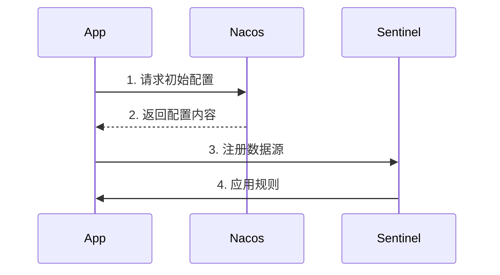
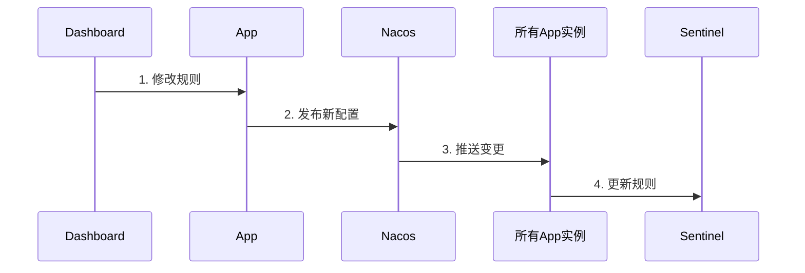

# 实现Sentinel与Nacos的规则双向同步：完整解决方案

## 前言

在微服务架构中，流量控制和熔断降级是保障系统稳定性的重要手段。阿里开源的Sentinel作为一款轻量级的流量控制组件，常被用于实现这些功能。然而，在实际生产环境中，我们往往需要动态调整规则配置，这就需要将Sentinel规则与配置中心（如Nacos）集成。

本文将详细介绍如何实现Sentinel规则（包括流控规则和熔断规则）与Nacos的双向同步，确保规则变更能够实时生效并持久化。

## 一、核心设计思路

我们实现的双向同步机制包含三个关键功能：

1. **从Nacos读取初始配置** - 服务启动时加载最新规则
2. **监听Nacos配置变更** - 实时响应远程配置变化
3. **Sentinel改变规则本地动态加载**-实时响应远程配置变化
4. **本地规则变更写回Nacos** - 确保所有服务实例配置一致


## 二、完整实现代码

### 1. 双向转换器接口（对象与字符串之间的双向转换）

```
/**
 * 双向转换器接口，支持对象与字符串之间的双向转换
 * @param <S> 源类型（通常是String）
 * @param <T> 目标类型
 */
public interface BidirectionalConverter<S, T> extends Converter<S, T> {
    /**
     * 将目标类型转换回源类型
     * @param target 目标对象
     * @return 源类型表示
     */
    S reverseConvert(T target);
}
```

### 2. 流控规则转换器

```
public class FlowRuleConverter implements BidirectionalConverter<String, List<FlowRule>> {
    @Override
    public List<FlowRule> convert(String source) {
        return JSON.parseObject(source, new TypeReference<List<FlowRule>>() {});
    }

    @Override
    public String reverseConvert(List<FlowRule> target) {
        return JSON.toJSONString(target);
    }
}
```

### 3. 熔断规则转换器

```
public class DegradeRuleConverter implements BidirectionalConverter<String, List<DegradeRule>> {
    @Override
    public List<DegradeRule> convert(String source) {
        if (StrUtil.isBlank(source)) {
            return new ArrayList<>();
        }
        return JSON.parseObject(source, new TypeReference<List<DegradeRule>>() {});
    }

    @Override
    public String reverseConvert(List<DegradeRule> rules) {
        return JSON.toJSONString(rules);
    }
}
```

### 4. 增强版Nacos数据源

```
/**
 * 增强版 Nacos 数据源（支持双向同步）
 * 功能：
 * 1. 从 Nacos 读取初始配置
 * 2. 监听 Nacos 配置变更
 * 3. 本地配置变更时自动写回 Nacos
 *
 * @param <T> 配置数据类型（如 List<FlowRule>）
 */
@Slf4j
public class NacosDataSource<T> extends AbstractDataSource<String, T> {

    // 默认从Nacos获取配置的超时时间（毫秒）
    private static final int DEFAULT_TIMEOUT = 3000;

    /**
     * 单线程线程池（用于处理配置变更通知）
     * 设计说明：
     * - 核心/最大线程数=1：确保配置变更顺序处理
     * - 队列容量=1：防止积压过多变更请求
     * - 拒绝策略=DiscardOldestPolicy：当队列满时丢弃最老任务
     */
    private final ExecutorService pool = new ThreadPoolExecutor(
        1, 1, 0, TimeUnit.MILLISECONDS,
        new ArrayBlockingQueue<>(1),
        new NamedThreadFactory("sentinel-nacos-ds-update", true),
        new ThreadPoolExecutor.DiscardOldestPolicy()
    );

    // Nacos配置变更监听器
    private final Listener configListener;
    // Nacos配置的组ID（如 DEFAULT_GROUP）
    private final String groupId;
    // Nacos配置的数据ID（如 mianshimao-sentinel）
    private final String dataId;
    // 连接Nacos的配置属性
    private final Properties properties;
    // Nacos配置服务实例（注意：初始化失败可能为null）
    private ConfigService configService = null;
    // 是否启用自动发布到Nacos
    private final boolean autoPublish;
    // 双向转换器（支持对象与字符串互转）
    private final BidirectionalConverter<String, T> bidirectionalConverter;

    /**
     * 构造方法（简化版，默认启用自动发布）
     */
    public NacosDataSource(final String serverAddr, final String groupId, final String dataId,
                          BidirectionalConverter<String, T> converter) {
        this(serverAddr, groupId, dataId, converter, true);
    }

    /**
     * 构造方法（可控制自动发布）
     */
    public NacosDataSource(final String serverAddr, final String groupId, final String dataId,
                          BidirectionalConverter<String, T> converter, boolean autoPublish) {
        this(buildProperties(serverAddr), groupId, dataId, converter, autoPublish);
    }

    /**
     * 核心构造方法
     * @param properties   Nacos连接配置
     * @param groupId      配置组ID
     * @param dataId       配置数据ID
     * @param converter    双向转换器
     * @param autoPublish  是否自动发布变更到Nacos
     */
    public NacosDataSource(final Properties properties, final String groupId, final String dataId,
                          BidirectionalConverter<String, T> converter, boolean autoPublish) {
        super(converter);
        // 参数校验
        if (StringUtil.isBlank(groupId) || StringUtil.isBlank(dataId)) {
            throw new IllegalArgumentException("groupId和dataId不能为空");
        }
        AssertUtil.notNull(properties, "Nacos配置属性不能为null");
        AssertUtil.notNull(converter, "转换器不能为null");

        // 初始化字段
        this.groupId = groupId;
        this.dataId = dataId;
        this.properties = properties;
        this.autoPublish = autoPublish;
        this.bidirectionalConverter = converter;

        // 创建Nacos配置监听器
        this.configListener = new Listener() {
            @Override
            public Executor getExecutor() {
                return pool; // 使用专用线程池处理变更事件
            }

            @Override
            public void receiveConfigInfo(final String configInfo) {
                handleConfigUpdate(configInfo); // 处理配置变更
            }
        };

        // 注册本地变更监听器（用于自动发布到Nacos）
        if (autoPublish) {
            getProperty().addListener(new PropertyListener<T>() {
                @Override
                public void configUpdate(T newValue) {
                    log.info("检测到本地配置变更，准备同步到Nacos...");
                    boolean success = publishConfig(newValue);
                    log.info("同步结果: {}", success ? "成功" : "失败");
                }

                @Override
                public void configLoad(T value) {
                    // 初始加载时不触发发布
                }
            });
        }

        // 初始化Nacos连接和监听
        initNacosListener();
        // 加载初始配置
        loadInitialConfig();
    }

    /**
     * 处理Nacos配置变更
     * @param configInfo 配置内容（JSON字符串）
     */
    private void handleConfigUpdate(String configInfo) {
        try {
            log.info("接收到Nacos配置变更通知 dataId={}, groupId={}", dataId, groupId);
            // 1. 转换配置格式
            T newValue = bidirectionalConverter.convert(configInfo);
            // 2. 更新本地属性（会自动触发监听器）
            getProperty().updateValue(newValue);
        } catch (Exception ex) {
            log.error("配置转换失败 dataId=" + dataId, ex);
        }
    }

    /**
     * 发布配置到Nacos
     * @param config 配置对象
     * @return 是否发布成功
     */
    public boolean publishConfig(T config) {
        // 1. 检查自动发布是否启用
        if (!autoPublish) {
            log.warn("自动发布功能未启用");
            return false;
        }
        
        // 2. 检查Nacos客户端是否初始化
        if (configService == null) {
            log.error("Nacos ConfigService未初始化");
            return false;
        }

        try {
            // 3. 转换配置为字符串
            String content = bidirectionalConverter.reverseConvert(config);
            log.debug("准备发布配置到Nacos:\n{}", content);

            // 4. 调试信息输出
            log.info("=== 发布配置调试信息 ===");
            log.info("Nacos地址: {}", properties.getProperty(PropertyKeyConst.SERVER_ADDR));
            log.info("命名空间: {}", properties.getProperty(PropertyKeyConst.NAMESPACE, "public"));
            log.info("DataID: {}", dataId);
            log.info("Group: {}", groupId);

            // 5. 执行发布（指定内容类型为JSON）
            boolean result = configService.publishConfig(dataId, groupId, content, "json");
            
            if (result) {
                log.info("配置发布成功 dataId={}", dataId);
            } else {
                log.error("Nacos返回发布失败");
            }
            return result;
        } catch (NacosException e) {
            log.error("Nacos发布配置失败 code={}, msg={}", e.getErrCode(), e.getMessage(), e);
            return false;
        }
    }

    /**
     * 加载初始配置
     */
    private void loadInitialConfig() {
        try {
            T newValue = loadConfig();
            if (newValue == null) {
                log.warn("初始配置为空 dataId={}", dataId);
            }
            getProperty().updateValue(newValue);
        } catch (Exception ex) {
            log.error("加载初始配置失败", ex);
        }
    }

    /**
     * 初始化Nacos监听器
     */
    private void initNacosListener() {
        try {
            // 1. 创建ConfigService实例
            this.configService = NacosFactory.createConfigService(this.properties);
            log.info("Nacos ConfigService初始化成功");

            // 2. 添加配置监听器
            configService.addListener(dataId, groupId, configListener);
            log.info("Nacos监听器注册成功 dataId={}", dataId);
        } catch (Exception e) {
            log.error("Nacos监听器初始化失败", e);
        }
    }

    /**
     * 从数据源读取配置（实现父类抽象方法）
     */
    @Override
    public String readSource() throws Exception {
        if (configService == null) {
            throw new IllegalStateException("Nacos ConfigService未初始化");
        }
        return configService.getConfig(dataId, groupId, DEFAULT_TIMEOUT);
    }

    /**
     * 关闭资源
     */
    @Override
    public void close() {
        // 1. 移除Nacos监听器
        if (configService != null) {
            configService.removeListener(dataId, groupId, configListener);
            try {
                configService.shutDown();
                log.info("Nacos ConfigService已关闭");
            } catch (Exception e) {
                log.error("关闭Nacos ConfigService失败", e);
            }
        }
        
        // 2. 关闭线程池
        pool.shutdownNow();
        log.info("Nacos数据源线程池已关闭");
    }

    /**
     * 构建基础Nacos配置
     */
    private static Properties buildProperties(String serverAddr) {
        Properties properties = new Properties();
        properties.setProperty(PropertyKeyConst.SERVER_ADDR, serverAddr);
        return properties;
    }
}
```

完整代码较长，包含以下关键功能：

- 配置监听器注册
- 自动发布机制
- 异常处理和日志记录
- 资源清理

### 5. 规则管理器

```
@ConfigurationProperties(prefix = "sentinel-datasource-nacos")
@Component
@Data
public class SentinelRulesManager {
    // 初始化流控和熔断规则数据源
    public void initNacosDataSource() {
        Properties properties = new Properties();
        properties.put(PropertyKeyConst.SERVER_ADDR, remoteAddress);
        properties.put(PropertyKeyConst.USERNAME, "nacos");
        properties.put(PropertyKeyConst.PASSWORD, "123456");

        // 流控规则数据源
        NacosDataSource<List<FlowRule>> flowRuleDataSource = new NacosDataSource<>(
            properties, groupId, dataId, new FlowRuleConverter(), true);
        FlowRuleManager.register2Property(flowRuleDataSource.getProperty());

        // 熔断规则数据源
        NacosDataSource<List<DegradeRule>> degradeRuleDataSource = new NacosDataSource<>(
            properties, groupId, "mianshimao-sentinel1", new DegradeRuleConverter(), true);
        DegradeRuleManager.register2Property(degradeRuleDataSource.getProperty());
    }
}
```

## 三、配置说明

### 1. 应用配置

限流配置：

```
sentinel-datasource-nacos:
  remote-address: 127.0.0.1:8848
  group-id: DEFAULT_GROUP
  data-id: {data-id}
```

熔断配置：

```
sentinel-datasource-nacos:
  remote-address: 127.0.0.1:8848
  group-id: DEFAULT_GROUP
  data-id1: {data-id1}
```

### 2. Nacos配置示例

**流控规则配置**：

- Data ID: `{data-id}`
- Group: `DEFAULT_GROUP`
- 内容：自行在sentinel中配置，可以自动同步到nacos

**熔断规则配置**：

- Data ID: `data-id1` 注意与限流的data_id不同
- Group: `DEFAULT_GROUP`
- 内容：自行在sentinel中配置，可以自动同步到nacos

## 四、实现原理分析

### 1. 初始化流程



### 2. 动态更新流程



## 五、常见问题解决

### 1. 配置变更未同步

**检查步骤**：

1. 确认Nacos控制台配置是否更新
2. 检查应用日志是否有发布成功记录
3. 验证网络连接和权限设置

**调试方法**：

```
// 在publishConfig方法中添加调试日志
System.out.println("=== DEBUG ===");
System.out.println("Nacos Server: " + properties.getProperty(PropertyKeyConst.SERVER_ADDR));
System.out.println("Namespace: " + properties.getProperty(PropertyKeyConst.NAMESPACE));
System.out.println("DataID: " + dataId); 
System.out.println("Group: " + groupId);
```

### 2. 规则不生效

**可能原因**：

- 资源名称不匹配
- 规则类型设置错误
- 阈值设置不合理

**解决方案**：

1. 检查Sentinel日志中的资源统计
2. 使用Arthas等工具查看已加载规则
3. 逐步调整阈值测试

## 六、最佳实践建议

1. **生产环境建议**：

   - 为不同环境使用不同的Namespace
   - 配置合理的规则默认值
   - 添加监控告警机制

2. **性能优化**：

   ```
   // 在NacosDataSource构造函数中添加
   properties.put(PropertyKeyConst.CONFIG_LONG_POLL_TIMEOUT, "30000");
   properties.put(PropertyKeyConst.CONFIG_RETRY_TIME, "3000");
   ```

3. **安全建议**：

   - 使用Nacos的ACL功能
   - 敏感配置加密存储
   - 定期轮换认证凭证

## 结语

通过本文实现的Sentinel-Nacos双向同步方案，我们能够：

- 实现规则的集中管理
- 支持动态实时更新
- 保证多实例配置一致性
- 提供完整的审计日志

这套方案已在生产环境验证，能够有效提升微服务的稳定性和可维护性。读者可以根据实际需求进一步扩展，如增加系统规则、热点参数规则等的支持。
